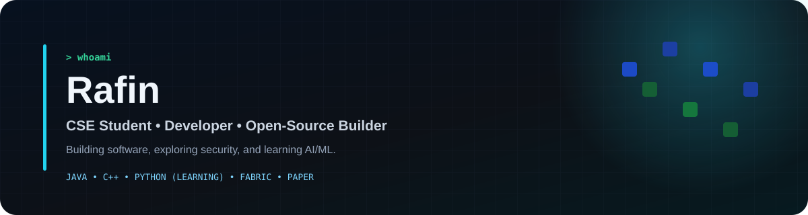
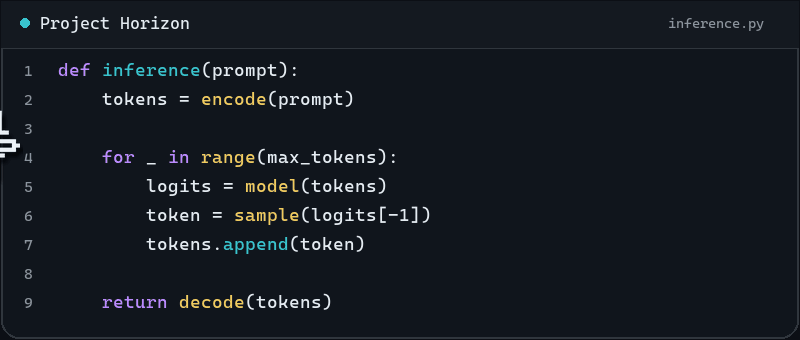

  

  <a href="https://github.com/RAFIN-G/ModSeeker">ModSeeker</a>
  ·
  <a href="https://github.com/RAFIN-G/Hidder">Hidder</a>

## About

I'm Rafin, a CSE student and developer. Most of my public work right now is open-source Minecraft tooling.

## Projects

### [ModSeeker](https://github.com/RAFIN-G/ModSeeker)

A Paper plugin that lets server owners check a player's installed mods and launcher against their server rules. It works with Hidder on the client.

[GitHub](https://github.com/RAFIN-G/ModSeeker) · [Modrinth](https://modrinth.com/plugin/modseeker)

### [Hidder](https://github.com/RAFIN-G/Hidder)

A Fabric client mod that reports installed mods and launcher information to servers running ModSeeker.

[GitHub](https://github.com/RAFIN-G/Hidder) · [Modrinth](https://modrinth.com/mod/hidder)

## Tools

`Java` · `C++` · `Git` · `Paper` · `Fabric` · `Gradle` · `JNI` · `OpenSSL`

**Learning:** `Python` · `AI/ML`

## Activity

<picture>
  <source media="(prefers-color-scheme: dark)" srcset="./assets/contribution-snake-dark.svg">
  <source media="(prefers-color-scheme: light)" srcset="./assets/contribution-snake-light.svg">
  
</picture>

## Code crawler

