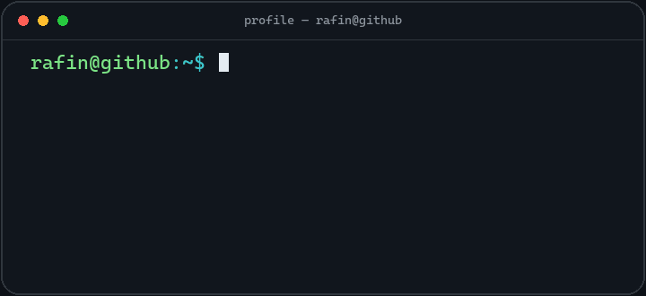
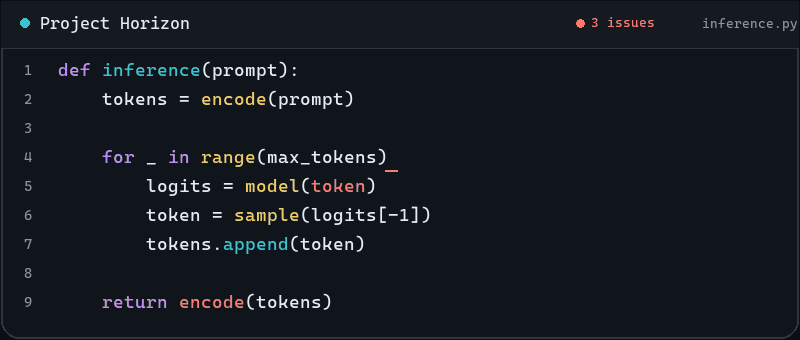

<p align="center">
  
</p>

## About

I like taking systems apart to understand how they work, then turning what I learn into useful tools. Most of my public work right now is open-source Minecraft tooling.

## Projects

<table>
  <tr>
    <td width="92" align="center">
      
    </td>
    <td>
      <strong><a href="https://github.com/RAFIN-G/ModSeeker">ModSeeker</a></strong><br>
      Minecraft server plugin for checking client mods and launchers against a server's rules. Works with Hidder for client-side verification.<br><br>
      <code>Java</code> <code>Paper</code> · <a href="https://github.com/RAFIN-G/ModSeeker">GitHub</a> · <a href="https://modrinth.com/plugin/modseeker">Modrinth</a>
    </td>
  </tr>
</table>

<table>
  <tr>
    <td width="92" align="center">
      
    </td>
    <td>
      <strong><a href="https://github.com/RAFIN-G/Hidder">Hidder</a></strong><br>
      Fabric client companion for ModSeeker that reports mod and launcher information for verification.<br><br>
      <code>Java</code> <code>Fabric</code> <code>C++</code> · <a href="https://github.com/RAFIN-G/Hidder">GitHub</a> · <a href="https://modrinth.com/mod/hidder">Modrinth</a>
    </td>
  </tr>
</table>

## Tools

`Java` · `C++` · `Git` · `Paper` · `Fabric` · `Gradle` · `JNI` · `OpenSSL`

**Learning:** `Python` · `AI/ML`

## Now

```text
learning    Python + AI/ML
building    ModSeeker / Hidder
exploring   new software ideas
```

## Activity

<picture>
  <source media="(prefers-color-scheme: dark)" srcset="./assets/contribution-snake-dark.svg">
  <source media="(prefers-color-scheme: light)" srcset="./assets/contribution-snake-light.svg">
  
</picture>

## Project Horizon


