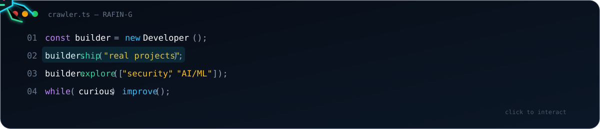

<div align="center">
  <picture>
    
  </picture>
</div>

<div align="center">
  <a href="https://github.com/RAFIN-G/ModSeeker"></a>
  <a href="https://github.com/RAFIN-G/Hidder"></a>
  <a href="https://modrinth.com/plugin/modseeker"></a>
</div>

## About

I’m **Rafin**, a CSE student and open-source developer who learns by building real systems. My current interests are software engineering, client/server architecture, defensive security, and AI/ML experimentation.

- Building and maintaining public Minecraft software
- Exploring authentication, verification, and practical security boundaries
- Learning AI/ML without pretending to be an expert
- Revisiting shipped projects to improve their architecture and reliability

## Featured projects

| Project | Role | What it does | Stack |
| --- | --- | --- | --- |
| **[ModSeeker](https://github.com/RAFIN-G/ModSeeker)** | Creator and developer | Paper plugin for server-owned mod policy and client-verification workflows | Java, Paper, Gradle |
| **[Hidder](https://github.com/RAFIN-G/Hidder)** | Creator and developer | Fabric companion that gathers client-side evidence for ModSeeker | Java, Fabric, C++, JNI, OpenSSL |

These projects explore practical verification controls. They do not claim that attacker-controlled clients are impossible to bypass.

## Tools and technologies

`Java` · `C++` · `Python — learning` · `Git` · `GitHub` · `Paper` · `Fabric` · `Gradle` · `JNI` · `OpenSSL`

## Currently exploring

```text
software security  /  client-server systems  /  AI/ML learning  /  open source
```

## Contribution trail

<picture>
  <source media="(prefers-color-scheme: dark)" srcset="https://raw.githubusercontent.com/RAFIN-G/RAFIN-G/output/github-contribution-grid-snake-dark.svg">
  <source media="(prefers-color-scheme: light)" srcset="https://raw.githubusercontent.com/RAFIN-G/RAFIN-G/output/github-contribution-grid-snake.svg">
  
</picture>

## Release the crawler

<a href="https://rafin-g.github.io/RAFIN-G/crawler/">
  
</a>

The crawler preview is an animation. The linked GitHub Pages version reacts to code as you hover.

